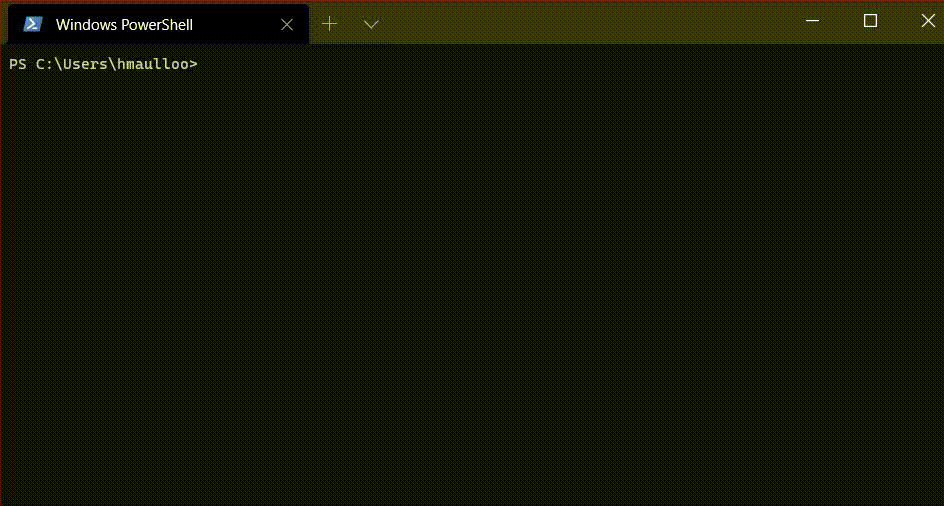

# Build Node App

Build a node application boilerplate by running one command!

<!--  -->


## How to use?
```
$ npx build-node-app app-name
```

## Example
```
$ npx build-node-app hello-world
$ cd hello-world
$ node index.js
```

## Directory
```
hello-world
  - node_modules/
  - index.js
  - package.json
```

## Arguments
| Arg | Argument | Description |
| ----------- | ----------- | ----------- |
| -p | --port | Specify port number to serve the app. Default is 3000 |
|  | --mongodb | Install and import mongodb to your app |
|  | --mysql | Install and import mysql to your app |
|  | --cors | Install and import cors to your app |
|  | --git | Initialise the project as a git project. Add .git and .gitignore |
| -v | --version | Specify version of app |

[NPM Package](https://www.npmjs.com/package/build-node-app) - [Github Repository](https://github.com/hackersdotmu/build-node-app/)
